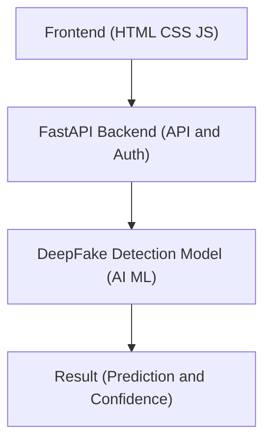

# 🕵️ DeepFake Detection Tool

An AI-powered web application that detects **deepfake content** across **images, videos, and audio**.  
The system uses a **custom-trained deep learning model** exposed via a **FastAPI backend**, with a lightweight web-based frontend for real-time analysis.

---

## 🤗 Hugging Face Space (Live Demo)

A live, interactive demo of the **DeepFake Detection Tool** is hosted on **Hugging Face Spaces**, allowing users to test the model directly from the browser without local setup.

🔗 **Hugging Face Space:**  
[DeepFake Detection Tool – Live Demo](https://huggingface.co/spaces/Tophet12/deepfake-detector)

## 🚀 Features

- 🔍 Image DeepFake Detection  
- 🎥 Video DeepFake Detection  
- 🎧 Audio DeepFake Detection  
- ⚡ FastAPI-based backend  
- 🌐 Web frontend (HTML, CSS, JavaScript)  
- ☁️ Cloud deployment (Hugging Face)  
- 🔐 Secure API-key based access  

---

## 🧠 How It Works

1. User uploads an image, video, or audio file
2. Frontend sends the file to the FastAPI backend
3. Backend processes the input using a trained AI model
4. The model analyzes deepfake artifacts and inconsistencies
5. Result is returned as **Real/Fake** with a confidence score

---

## 🏗️ System Architecture

---

## 🛠️ Tech Stack

### Frontend
- HTML5
- CSS3
- JavaScript (Vanilla)
- Font Awesome

### Backend
- Python 3.10+
- FastAPI
- Uvicorn

### AI / ML
- PyTorch / TensorFlow (model dependent)
- OpenCV
- NumPy
- Custom-trained DeepFake Detection Model

### Deployment
- Render (Backend & Model)
- GitHub (Version Control)

---

## ⚙️ Installation & Local Setup

### 1️⃣ Clone the Repository
```bash
git clone https://github.com/your-username/deepfake-detection-tool.git
cd deepfake-detection-tool
cd backend
pip install -r requirements.txt
uvicorn main:app --reload
```
| Media Type | Formats  |
| ---------- | -------- |
| Image      | JPG, PNG |
| Video      | MP4, AVI |
| Audio      | WAV, MP3 |


⭐ If you find this project useful, consider starring the repository!
